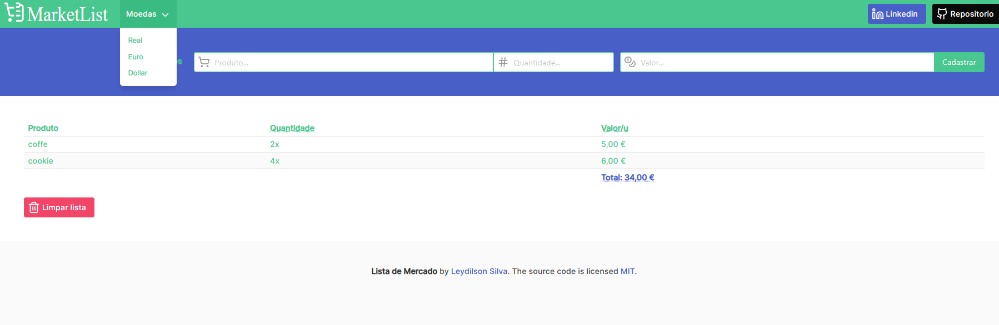

Pagina voltada a criação de lista de compras com seleção de moeda e calculo de total da compra.

[Acesse aqui!](https://leydilson-silva.github.io/SuperMarket/)

## Preview

## Documentação de cores
| Cores de fundo                                                   | Cor do texto                                                 |
| ---------------------------------------------------------------- | ----------------------------------------------------------------|
|  #ffffff    |  #ffffff |
|  #fafafa |  #fafafa |
|  #48c78e |  #48c78e |
|  #f14668 |  #485fc7 |
|  #485fc7 |  #4a4a4a |
|  #0a0a0a |  #363636 | 
|                                                                  |  #000000 |

## Stack utilizada

**Front-end:** 
- HTML
- JavaScript(vanila)
- BulmaCSS

## Funcionalidades

- Preview em tempo real
- Responsividade

## Referência

 - [Developer Mozilla](https://developer.mozilla.org/en-US/docs/Web/JavaScript/Reference/Global_Objects/Intl/NumberFormat/NumberFormat)
 - [Bulma Documentation](https://bulma.io/documentation/)
 - [Danki Code - javascript Completo](https://cursos.dankicode.com/curso-javascript-completo)
 - [Awesome Readme Templates](https://awesomeopensource.com/project/elangosundar/awesome-README-templates)

## 🔗 Contatos
 

## Licença

[MIT](https://choosealicense.com/licenses/mit/)

